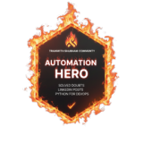

<h1 align="center">Sanket Dangat</h1>
<h3 align="center">Cloud & DevOps Engineer</h3>

  Building scalable cloud infrastructure through Automation, DevSecOps, and GitOps practices.

  

---

## 👨‍💻 About Me

Cloud & DevOps Engineer with **2+ years of IT experience**, including **1.5 years of hands-on experience** in Cloud and DevOps technologies. Skilled in AWS, Terraform, Jenkins, Docker, Kubernetes, Linux, monitoring, and cloud operations.

**Open to opportunities** in DevOps Engineering, Cloud Engineering, and Cloud Support roles.

---

## 🏆 Achievements & Recognition

### Automation Hero — TrainWithShubham Community

  

Recognized as an **Automation Hero** on the TrainWithShubham Heroes Wall for community contributions, knowledge sharing, and helping learners in Cloud, DevOps, and Automation.

#### Additional Community Recognition
- 🏅 Community Builder of the Week — March 2026
- 🏅 Community Builder of the Week — February 2026

---

## Featured Projects

### SkillPulse — Production-Grade GitOps Platform on AWS & Amazon EKS

**Repository:** [SkillPulse](https://github.com/srdangat/skillpulse-eks-gitops-platform)  
**Tech Stack:** Terraform • AWS • Amazon EKS • Kubernetes • ArgoCD • GitHub Actions • Prometheus • Grafana

- Provisioned AWS infrastructure using Terraform
- Deployed and managed applications on Amazon EKS
- Implemented GitOps workflows with ArgoCD
- Automated CI/CD pipelines using GitHub Actions
- Integrated GitHub OIDC authentication with AWS IAM
- Managed secrets using AWS Secrets Manager and CSI Driver
- Configured dynamic persistent storage with EBS CSI Driver
- Implemented Horizontal Pod Autoscaling (HPA)
- Enabled monitoring and observability using Prometheus and Grafana
- Integrated security scanning with Trivy, Gitleaks, Hadolint, and Govulncheck

---

### Secure DevSecOps CI/CD Pipeline for Node.js

**Repository:** [DevSecOps Pipeline](https://github.com/srdangat/devsecops-github-actions-pipeline)  
**Tech Stack:** GitHub Actions • Docker • Trivy • Node.js • Express.js

- Automated CI/CD workflows using GitHub Actions (PR validation + main branch pipeline)
- Shift-Left security with early vulnerability detection
- Trivy-based security scanning for dependencies and container images
- Dockerized application with secure multi-stage builds
- Reusable CI/CD jobs for build and test automation
- Dependency review for secure package management
- Scheduled health checks for continuous application monitoring

---

## 💼 Experience

| Role | Company | Period |
|--------|---------|---------|
| **Cloud Consultant (Internship)** | SELA | Apr 2025 – Oct 2025 |
| **DevOps Engineer (Internship)** | Hisan Labs Pvt Ltd | Apr 2024 – Apr 2025 |
| **Jr. IT Executive** | ITC Infotech | Apr 2023 – Feb 2024 |
| **Desktop Support Engineer** |  Innovative Digitech Services | Mar 2022 – Apr 2023 |

---

## Skills & Tools

### Cloud & Infrastructure

### Containers & DevOps

### Monitoring & Observability

### Operating Systems & Version Control

---

## 📈 GitHub Activity

---

## 📚 Currently Learning

- Python for DevOps Automation

---

## 🤝 Connect With Me

- [LinkedIn](https://www.linkedin.com/in/sanket-dangat-6462b8271/)
- [GitHub](https://github.com/srdangat)
- [Email](sanket.r.dangat@gmail.com)

---
